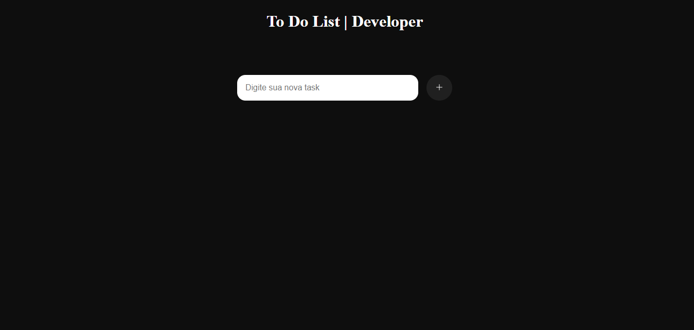
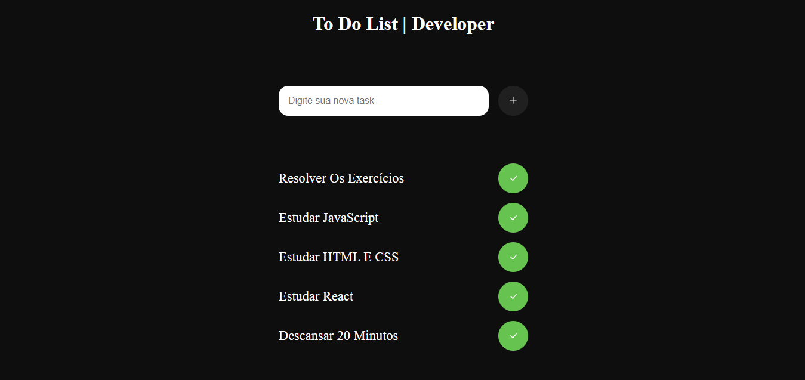

<h1>To-Do List Project</h1>

 Este é um projeto de To-Do List (lista de tarefas) desenvolvido utilizando linguagens web como HTML, CSS e JavaScript. A aplicação permite que os usuários criem, editem e removam tarefas de sua lista pessoal. 

<h2>Funcionalidades</h2>

<li> 
<ul>Adicionar uma nova tarefa à lista.</ul>        
<ul>Marcar uma tarefa como concluída.</ul>  
</li>

<h2>Exemplo</h2>

